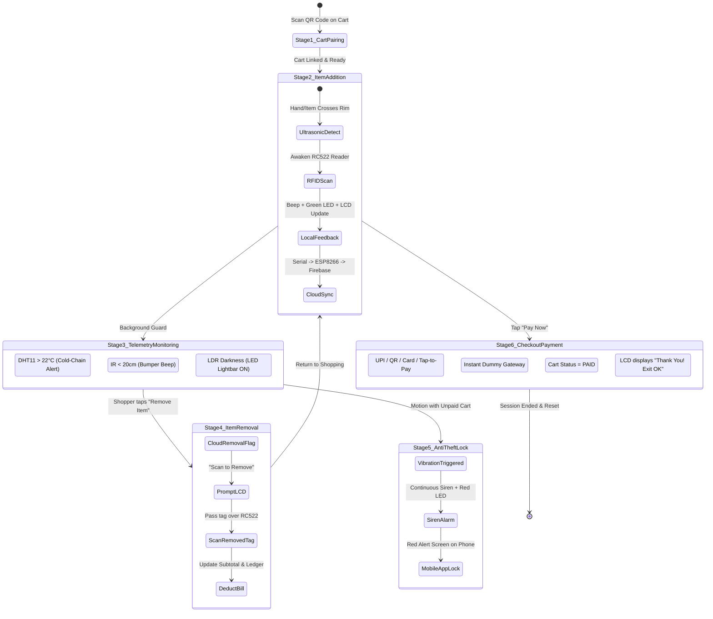

# 🛒 IoE Smart Shopping Cart System — Engineering Report & Documentation

[](https://react.dev/)
[](https://vitejs.dev/)
[](https://firebase.google.com/)
[](https://www.arduino.cc/)
[](https://www.espressif.com/)
[](LICENSE)

An end-to-end **Internet of Everything (IoE)** automated retail checkout and telemetry platform. This project integrates an **Arduino Uno** multi-sensor embedded suite, an **ESP8266 Wi-Fi Cloud Gateway**, **Firebase Realtime Database**, and a responsive **React 19 + Vite Mobile Web Application** to eliminate checkout queues, provide cold-chain safety alerts, enforce anti-theft security, and enable instant mobile payments.

---

## 📑 Table of Contents

1. [Executive Summary & Abstract](#1-executive-summary--abstract)
2. [Problem Statement vs Proposed Solution](#2-problem-statement-vs-proposed-solution)
3. [Key System Features](#3-key-system-features)
4. [Hardware Master Bill of Materials (BOM)](#4-hardware-master-bill-of-materials-bom)
5. [Hardware Circuit Pinout & Interfacing](#5-hardware-circuit-pinout--interfacing)
6. [System Architecture & Data Flow](#6-system-architecture--data-flow)
7. [The 6-Stage Operational Lifecycle](#7-the-6-stage-operational-lifecycle)
8. [Firebase Realtime Database Schema](#8-firebase-realtime-database-schema)
9. [Firmware Implementation Details](#9-firmware-implementation-details)
10. [Mobile Web Application (React 19 + Vite)](#10-mobile-web-application-react-19--vite)
11. [Installation & Setup Guide](#11-installation--setup-guide)
12. [Anti-Theft & Edge-Case Protection](#12-anti-theft--edge-case-protection)
13. [Troubleshooting & Calibration](#13-troubleshooting--calibration)
14. [Repository Directory Structure](#14-repository-directory-structure)
15. [Future Scope & Roadmap](#15-future-scope--roadmap)
16. [License & Acknowledgments](#16-license--acknowledgments)

---

## 1. Executive Summary & Abstract

Traditional retail stores lose millions in revenue and customer satisfaction annually due to manual checkout bottlenecking, cashier queues, scanning discrepancies, and shoplifting. 

The **IoE Smart Shopping Cart System** transforms a standard retail shopping cart into an intelligent, autonomous IoT node. When a consumer drops a tagged product into the cart, an ultrasonic rim sensor awakens the RFID scanner to register the item. Embedded environmental and kinematic sensors continuously inspect basket temperature, obstacle distance, ambient aisle lighting, and cart movement. An ESP8266 Wi-Fi bridge synchronizes all telemetry and inventory events in real time (< 300 ms latency) with Firebase Cloud. Shoppers view their live bill, virtual LCD mirror, cold-item alerts, and pay directly on their phone using UPI/Card without waiting in a single queue.

---

## 2. Problem Statement vs Proposed Solution

| Parameter | Traditional Supermarket Checkout | IoE Smart Shopping Cart System |
|---|---|---|
| **Checkout Time** | 10–25 minutes waiting in queue | **Instant (< 10 seconds)** via smartphone |
| **Price Transparency** | Total cost unknown until cashier scans | **Real-time running subtotal** on cart LCD & phone |
| **Product Removal** | Manual cashier intervention required | **Cloud-driven 2-step verification** via app & scanner |
| **Cold-Chain Safety** | Melted ice cream or spoiled milk unnoticed | **DHT11 cold-chain warning** if basket gets too warm |
| **Cart Collision** | Accidents with elderly shoppers or shelves | **IR proximity sensor** with acoustic warning beep |
| **Aisle Visibility** | Dim aisles cause poor product visibility | **LDR sensor** triggers automatic cart headlamp |
| **Anti-Theft** | Gate beepers after exiting the store | **SW-420 motion sensor** locks unpaid cart & triggers siren |

---

## 3. Key System Features

- **Automated Scan-and-Go:** Dual ultrasonic + RC522 RFID system scans products instantly as they cross the cart rim.
- **Hardware-to-Cloud Mirroring:** 16x2 / 20x4 I2C LCD on the cart mirrors perfectly onto the shopper’s mobile interface.
- **Perishable Cold-Chain Monitoring:** Alerts the customer if refrigerated products (milk, butter, meats) are warming up (> 22°C).
- **Proximity Safety Bumper:** Front-mounted IR obstacle sensor sounds an audio warning if the cart nears a shelf or customer (< 20 cm).
- **Aisle Lighting Automation:** Light-dependent resistor (LDR) automatically activates the basket LED bar in darker aisles.
- **Cloud-Driven Item Removal:** Shopper initiates removal in the mobile UI, prompting the hardware into removal mode to prevent fraud.
- **Tamper & Theft Alarm:** Built-in SW-420 vibration detector triggers a continuous siren and mobile lock-screen if an unpaid cart is pushed past checkout.
- **Multi-Modal Payment Suite:** Dummy checkout supporting UPI (Google Pay, PhonePe, Paytm, dynamic QR), Credit/Debit Card, and Net Banking with downloadable digital invoice.
- **Integrated Hardware Sandbox:** Web app includes a built-in virtual test bench allowing full system simulation without breadboards.

---

## 4. Hardware Master Bill of Materials (BOM)

| Component | Specification | Interface | Role in System |
|---|---|---|---|
| **Microcontroller** | Arduino Uno R3 (ATmega328P) | Digital / Analog / SPI / I2C | Core controller reading sensors and executing hardware logic |
| **Wi-Fi Gateway** | ESP8266 (ESP-01 or NodeMCU) | UART Serial (8, A0) | Bi-directional Wi-Fi gateway to Firebase Realtime Database |
| **RFID Reader** | MFRC522 (13.56 MHz) | SPI (D10, D11, D12, D13, D9) | Scans 13.56 MHz RFID cards, keyfobs, and adhesive tags |
| **Entry Detector** | HC-SR04 Ultrasonic Sensor | Digital GPIO (D6 Trig, D7 Echo) | Detects items passing into the basket rim |
| **Local Display** | 16x2 or 20x4 I2C LCD (PCF8574) | I2C (A4 SDA, A5 SCL) | Onboard visual display for item name, price, subtotal, and alerts |
| **Cold-Chain Sensor** | DHT11 Temperature & Humidity | Digital GPIO (D2) | Tracks ambient temperature of items in cart |
| **Safety Bumper** | Active IR Obstacle Sensor | Digital GPIO (D3) | Detects close obstacles (< 20 cm) ahead of cart |
| **Ambient Lighting** | LDR Photoresistor Module | Digital GPIO (D4) | Detects low aisle light levels |
| **Anti-Theft Motion**| SW-420 Vibration Sensor | Digital GPIO (D5) | Detects movement when cart is unpaid |
| **Acoustic Feedback**| 5V Active Buzzer | Digital GPIO (A1) | Audio beeps for scans, warnings, and anti-theft siren |
| **Optical Feedback** | Green & Red 5mm LEDs | Digital GPIO (A2 Green, A3 Red) | Green = item accepted / success; Red = error / warning |
| **Power Supply** | 5V 2A Power Bank / Dual Battery | USB & 3.3V Regulator | Powers Uno, ESP8266, and all sensor rails |

---

## 5. Hardware Circuit Pinout & Interfacing

### 🔌 Complete Arduino Uno Pin Mapping Table

| Pin | Connected Component | Signal / Role | Voltage | Special Notes |
|---|---|---|---|---|
| **0 (RX)** | Free (USB Debug) | Hardware Serial RX | 5V | Keep free for PC Serial Monitor debugging |
| **1 (TX)** | Free (USB Debug) | Hardware Serial TX | 5V | Keep free for PC Serial Monitor debugging |
| **2** | DHT11 Sensor | Data Pin | 5V / 3.3V | Temperature & humidity sensing |
| **3** | IR Obstacle Sensor | DO (Digital Out) | 5V | Active LOW when obstacle is near (< 20 cm) |
| **4** | LDR Sensor Module | DO (Digital Out) | 5V | Active HIGH in darkness |
| **5** | SW-420 Vibration Sensor | DO (Digital Out) | 5V | Active HIGH on vibration/motion |
| **6** | HC-SR04 Ultrasonic | Trigger Pin | 5V | 10 µs pulse to trigger sonar ping |
| **7** | HC-SR04 Ultrasonic | Echo Pin | 5V | Measures return pulse duration |
| **8** | ESP8266 Gateway | TX from ESP8266 | 3.3V → 5V | SoftwareSerial RX on Arduino |
| **9** | RC522 RFID Module | RST (Reset) | 3.3V | RFID hardware reset pin |
| **10** | RC522 RFID Module | SDA / SS (Chip Select)| 3.3V | SPI Slave Select |
| **11** | RC522 RFID Module | MOSI | 3.3V | SPI Master Out Slave In |
| **12** | RC522 RFID Module | MISO | 3.3V | SPI Master In Slave Out |
| **13** | RC522 RFID Module | SCK (SPI Clock) | 3.3V | Hardware SPI Clock |
| **A0** | ESP8266 Gateway | RX of ESP8266 | 5V → 3.3V | **Requires Voltage Divider (1kΩ + 2kΩ)** |
| **A1** | 5V Active Buzzer | VCC / Control | 5V | High = Sound ON, Low = Sound OFF |
| **A2** | Status LED Green | Anode (+) via 220Ω | 5V | Scan confirmation / System Ready |
| **A3** | Status LED Red | Anode (+) via 220Ω | 5V | Alarm / Error / Item Removal |
| **A4** | I2C LCD Display | SDA | 5V | Serial Data for LCD |
| **A5** | I2C LCD Display | SCL | 5V | Serial Clock for LCD |

> [!CAUTION]
> **CRITICAL VOLTAGE SAFEGUARDS:**
> 1. **RC522 VCC MUST be connected to 3.3V only.** Connecting to 5V will permanently destroy the RFID chip.
> 2. **ESP8266 RX operates at 3.3V logic.** Connect Arduino A0 to ESP8266 RX via a voltage divider (1kΩ from A0 to ESP RX, and 2kΩ from ESP RX to GND).
> 3. **Common Ground:** All modules, the ESP8266, and Arduino Uno MUST share a common GND rail.

---

## 6. System Architecture & Data Flow

```
                      ┌───────────────────────────────────────────────┐
                      │          Firebase Realtime Database           │
                      │  https://<project-id>-default-rtdb.firebaseio │
                      └───────┬───────────────────────────────┬───────┘
                              │                               │
              HTTPS REST API  │                               │ WebSockets / WSS
              (Poll & Patch)  │                               │ (Instant Push)
                              ▼                               ▼
               ┌───────────────────────────────┐  ┌───────────────────────────────┐
               │    ESP8266 Wi-Fi Gateway      │  │     Shopper's Mobile PWA      │
               │   (esp8266_firebase_gateway)  │  │     (React 19 + Vite App)     │
               └──────────────┬────────────────┘  └───────────────────────────────┘
                              │ SoftwareSerial
                              │ 9600 Baud (8, A0)
                              ▼
               ┌───────────────────────────────┐
               │       Arduino Uno Hub         │
               │    (smart_cart_arduino.ino)   │
               └──────────────┬────────────────┘
                              │
     ┌────────────────────────┼────────────────────────┐
     ▼                        ▼                        ▼
[RC522 RFID]            [Sensors Suite]           [Outputs]
• SPI Bus               • HC-SR04 Ultrasonic      • 16x2 I2C LCD
• UID Read/Write        • DHT11 Temp/Humidity     • Active Buzzer
• Anti-collision        • IR Obstacle Bumper      • Dual Status LEDs
                        • LDR Aisle Light         • LED Headlamp
                        • SW-420 Anti-Theft
```

---

## 7. The 6-Stage Operational Lifecycle



---

## 8. Firebase Realtime Database Schema

```json
{
  "store_info": {
    "name": "SuperMart IoE Store #101",
    "currency": "Rs.",
    "tax_rate": 0.05
  },
  "products": {
    "TAG_MILK_01": {
      "id": "TAG_MILK_01",
      "name": "Organic Whole Milk 1L",
      "category": "Dairy",
      "price": 60.00,
      "isCold": true,
      "weight_g": 1030,
      "barcode": "8901030889211"
    },
    "TAG_BREAD_02": {
      "id": "TAG_BREAD_02",
      "name": "Artisan Sourdough Bread",
      "category": "Bakery",
      "price": 45.00,
      "isCold": false,
      "weight_g": 400,
      "barcode": "8901030889228"
    },
    "TAG_COFFEE_03": {
      "id": "TAG_COFFEE_03",
      "name": "Single Origin Dark Roast Coffee",
      "category": "Beverages",
      "price": 280.00,
      "isCold": false,
      "weight_g": 250,
      "barcode": "8901030889235"
    },
    "TAG_BUTTER_04": {
      "id": "TAG_BUTTER_04",
      "name": "Salted Farm Butter 500g",
      "category": "Dairy",
      "price": 125.00,
      "isCold": true,
      "weight_g": 500,
      "barcode": "8901030889242"
    }
  },
  "carts": {
    "CART_004": {
      "status": "UNPAID",
      "shopper_id": "USER_7894",
      "items": {
        "ITEM_1": {
          "tag_id": "TAG_MILK_01",
          "name": "Organic Whole Milk 1L",
          "price": 60.00,
          "qty": 1,
          "isCold": true,
          "timestamp": 1726650000
        }
      },
      "subtotal": 60.00,
      "tax": 3.00,
      "total": 63.00,
      "removal_mode": {
        "active": false,
        "target_tag": ""
      },
      "lcd_screen": {
        "line1": "Milk 1L  Rs.60",
        "line2": "TOTAL:   Rs.60"
      },
      "telemetry": {
        "temperature": 24.5,
        "humidity": 62.0,
        "cold_alert": true,
        "obstacle_near": false,
        "dim_lighting": false,
        "theft_vibration": false,
        "last_sync": 1726650045
      }
    }
  },
  "bills": {
    "BILL_CART_004_1726650100": {
      "cart_id": "CART_004",
      "payment_method": "UPI",
      "payment_status": "SUCCESS",
      "total_paid": 63.00,
      "timestamp": 1726650100
    }
  }
}
```

---

## 9. Firmware Implementation Details

### A. Arduino Uno Controller (`firmware/smart_cart_arduino.ino`)
- **SoftwareSerial Architecture:** Uses `SoftwareSerial espSerial(8, A0)` for isolated communication with the ESP8266, keeping Pins 0 & 1 entirely free for debugging through the Arduino IDE Serial Monitor without baud rate conflicts.
- **Non-blocking Timing:** All sensor sampling, LCD refreshing, and alert sirens use `millis()` timing routines to ensure zero lag on RFID scanning.
- **Debounced RFID Reading:** Tag read cooldowns prevent duplicate scans when items rest near the antenna coil.

### B. ESP8266 Cloud Gateway (`firmware/esp8266_firebase_gateway.ino`)
- **HTTPS REST Engine:** Connects via standard Wi-Fi (`WiFiClientSecure`) and performs optimized REST calls (`PATCH` / `PUT` / `GET`) directly against the Firebase Realtime Database URL.
- **Serial Protocol Parsing:** Interprets compact JSON messages received from the Arduino (e.g. `ADD:<TAG_ID>`, `REM:<TAG_ID>`, `TELEM:<T>,<H>,<ALERT>`) and translates them into Firebase database modifications.

---

## 10. Mobile Web Application (React 19 + Vite)

The companion mobile app is located in `mobile-app/` and offers a shopper-first experience designed for handheld mobile screens:

- **Pairing via QR Scanner:** Built-in HTML5 camera QR reader to pair with any cart ID instantly (`CART_004`, `CART_001`, etc.).
- **Live Virtual LCD:** Replicates the physical 16x2 cart display in real-time, giving shoppers confidence in their hardware tally.
- **Perishable Alert Banner:** Visual warning appears the moment a cold item temperature crosses 22°C.
- **Item Removal Flow:** Shoppers click remove on their phone, which automatically arms the physical cart reader to verify tag removal.
- **Checkout Modal:** Supports dummy UPI (with custom VPA validation), simulated UPI QR scanning, Credit/Debit card with Luhn check, and Apple/Google Tap-to-Pay.
- **Digital Receipt Generator:** Downloadable and printable invoice displaying store metadata, breakdown of GST/Taxes, and itemized ledger.
- **Hardware Sandbox (Simulator):** Allows reviewers or developers to simulate tag scans, ultrasonic triggers, temperature spikes, obstacle alerts, and vibration tamper alarms right in the browser without hardware plugged in.

---

## 11. Installation & Setup Guide

### 1. Prerequisites
- **Node.js** (v18.0.0 or higher)
- **Arduino IDE** (v2.0 or higher)
- A free [Google Firebase](https://console.firebase.google.com/) account

### 2. Firebase Database Setup
1. Create a new Firebase project at [console.firebase.google.com](https://console.firebase.google.com/).
2. Under **Build**, click **Realtime Database** -> **Create Database**.
3. Set your rules to public for development:
   ```json
   {
     "rules": {
       ".read": true,
       ".write": true
     }
   }
   ```
4. Click the three dots (⋮) on the top-right of your database view, select **Import JSON**, and choose [`firebase_seed.json`](firebase_seed.json) from this repository.
5. Copy your database URL: `https://<YOUR-PROJECT-ID>-default-rtdb.firebaseio.com/`.

### 3. Mobile Web App Setup
```bash
# Clone the repository
git clone https://github.com/<your-username>/SmartShoppingCart.git
cd SmartShoppingCart/mobile-app

# Copy environment template
cp .env.example .env

# Edit .env with your Firebase configuration
# VITE_FIREBASE_DATABASE_URL=https://<YOUR-PROJECT-ID>-default-rtdb.firebaseio.com/
# VITE_FIREBASE_API_KEY=AIzaSy...
# VITE_FIREBASE_PROJECT_ID=<YOUR-PROJECT-ID>

# Install dependencies
npm install

# Start development server
npm run dev
```
Open `http://localhost:5173` on your smartphone or desktop browser.

### 4. Firmware Installation
1. In the Arduino IDE, install the required libraries via **Sketch -> Include Library -> Manage Libraries**:
   - `MFRC522` by GithubCommunity
   - `LiquidCrystal_I2C` by Frank de Brabander
   - `DHT sensor library` by Adafruit
   - `ArduinoJson` by Benoît Blanchon
2. Flash [`firmware/smart_cart_arduino.ino`](firmware/smart_cart_arduino.ino) to your **Arduino Uno**.
3. Open [`firmware/esp8266_firebase_gateway.ino`](firmware/esp8266_firebase_gateway.ino), update your Wi-Fi credentials:
   ```cpp
   const char* WIFI_SSID     = "YOUR_WIFI_NAME";
   const char* WIFI_PASSWORD = "YOUR_WIFI_PASSWORD";
   ```
4. Flash the sketch to your **ESP8266** module (using a USB-to-TTL programmer or NodeMCU board).
5. Assemble the jumper wires according to [`firmware/HARDWARE_WIRING_GUIDE.md`](firmware/HARDWARE_WIRING_GUIDE.md).

---

## 12. Anti-Theft & Edge-Case Protection

1. **Unpaid Movement Detection:** If the cart's status in Firebase is `UNPAID` and the SW-420 sensor detects continuous wheel vibrations, the Arduino sounds an 85 dB active siren, illuminates the red LED, and locks the mobile app with an urgent security alert.
2. **Double-Scanning Prevention:** The system enforces a 1500 ms debounce filter on the MFRC522 reader. If an item is held near the reader, it will only register once.
3. **Removal Authentication:** To remove an item, the shopper must tap "Remove" in the mobile app first. The cloud places the cart in `REMOVAL_MODE`, requiring the physical tag to be passed by the sensor. Unauthorized items or arbitrary tags are rejected.
4. **Offline Resilience:** If Wi-Fi briefly drops, the Arduino maintains the local subtotal and item count in RAM and displays status updates on the I2C LCD until connection is re-established.

---

## 13. Troubleshooting & Calibration

| Symptom | Probable Cause | Corrective Action |
|---|---|---|
| **RC522 reader not detecting tags** | Voltage connected to 5V instead of 3.3V, or loose SPI jumper wires | Check 3.3V rail; inspect D10–D13 connections; ensure tags are 13.56 MHz RFID |
| **LCD displays black boxes only** | Incorrect I2C address or contrast potentiometer unadjusted | Adjust contrast pot on back of PCF8574 backpack; try I2C address `0x27` or `0x3F` |
| **ESP8266 keeps resetting** | Power starvation during Wi-Fi transmission spikes (requires ~250 mA) | Power ESP8266 with dedicated 3.3V rail or add 10 µF capacitor across VCC/GND |
| **Data not syncing to Firebase** | Incorrect database URL or trailing slash formatting | Ensure URL has no typos and includes `https://` prefix |
| **Temperature reading 0.0°C** | DHT11 data pin disconnected or pull-up missing | Verify DHT11 is wired to D2; ensure module has built-in pull-up resistor |

---

## 14. Repository Directory Structure

```
SmartShoppingCart/
├── .gitignore                         # Git ignore file for secrets, dependencies & builds
├── firebase.json                      # Firebase CLI configuration
├── firebase_seed.json                 # Pre-configured products and carts database export
├── package.json                       # Root script orchestrator
├── README.md                          # Comprehensive project engineering report
│
├── firmware/                          # Microcontroller source code & wiring diagrams
│   ├── HARDWARE_WIRING_GUIDE.md       # Pinout tables, schematics & voltage dividers
│   ├── smart_cart_arduino.ino         # Arduino Uno 11-sensor controller sketch
│   └── esp8266_firebase_gateway.ino   # ESP8266 Wi-Fi Firebase cloud gateway sketch
│
└── mobile-app/                        # React 19 + Vite Progressive Web Application
    ├── .env.example                   # Environment configuration template
    ├── index.html                     # Mobile viewport, web fonts & PWA entry
    ├── package.json                   # Web application dependencies & build scripts
    ├── vite.config.js                 # Vite build & proxy settings
    └── src/
        ├── App.jsx                    # Core 6-stage operational state orchestrator
        ├── firebase.js                # Firebase Realtime DB SDK & fallback layer
        ├── index.css                  # Modern responsive design system
        ├── main.jsx                   # React root mount
        └── components/
            ├── CartItemList.jsx       # Itemized running bill with removal action
            ├── CheckoutModal.jsx      # Dummy UPI, QR, and Card payment portal
            ├── ColdAlertBanner.jsx    # Perishable item warning notifications
            ├── HardwareSimulatorDrawer.jsx # Built-in browser-based hardware sandbox
            ├── LcdMirror.jsx          # Live onboard I2C LCD software mirror
            ├── Navbar.jsx             # Cart pairing status & Firebase health badge
            ├── QrScannerModal.jsx     # Live camera QR scanner & manual cart picker
            ├── ReceiptModal.jsx       # Digital receipt invoice with print/download
            ├── RemovalModal.jsx       # Stage 4 cloud-driven physical removal prompt
            ├── TelemetryBar.jsx       # Real-time sensor metrics (Temp, IR, LDR, Motion)
            └── TheftAlarmModal.jsx    # Stage 5 anti-theft siren & lockdown banner
```

---

## 15. Future Scope & Roadmap

- **Load Cell (Weight Sensor) Integration:** Incorporate HX711 dual load cells beneath the basket floor to cross-verify RFID item weights and detect un-scanned items.
- **Indoor Cart Navigation:** Implement Bluetooth Low Energy (BLE) or UWB beacons to guide customers along the shortest path to items on their digital shopping list.
- **Smart Dynamic Pricing:** Integrate automated shelf-tag syncing to push real-time discounts and bundle offers to the cart LCD.
- **AI Recommendation Engine:** Suggest complementary items based on items currently inside the cart (e.g., suggesting pasta sauce when pasta is scanned).

---

## 16. License & Acknowledgments

This project is licensed under the **MIT License** — feel free to modify and utilize it for academic, research, and commercial prototyping.

Developed with ❤️ as an Internet of Everything (IoE) innovation for modern retail.
